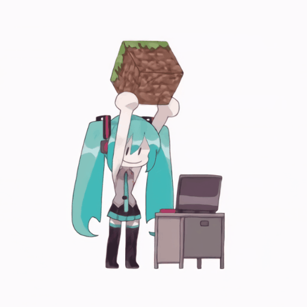

# Info
-----------

Hello everyone!   I'm Nick Salt, and i love python :3 Hobbyist 14lv.  Sometimes likes playing Minecraft  Sometimes works with node.js Sometimes i creating something in Unity  (Please, don't look in my projects which created with Unity)

  
Currently working on :  

<!----> 

-----------

Please visit my friend's [profile](https://github.com/Hatsune-Mikun)

  

# Stats

-----------

-----------

## P.S.
I can destroy games, sorry if i did this with your game.

<!---->
<!--
**BlueBerrySans365/BlueBerrySans365** is a ✨ _special_ ✨ repository because its `README.md` (this file1 appears on your GitHub profile.

Here are some ideas to get you started:

- 🔭 I’m currently working on ...
- 🌱 I’m currently learning ...
- 👯 I’m looking to collaborate on ...
- 🤔 I’m looking for help with ...
- 💬 Ask me about ...
- 📫 How to reach me: ...
- 😄 Pronouns: ...
- ⚡ Fun fact: ...
-->

